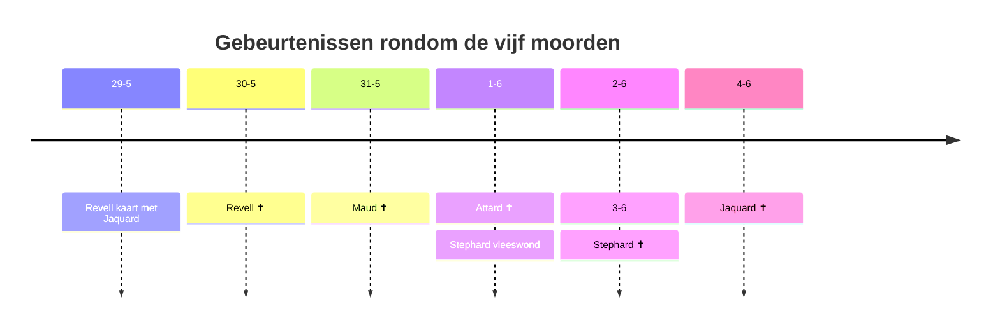

Er zijn vijf moorden gepleegd

1. [[Nathan Revell]] op 30-5
2. [[Cyril Maud]] op 31-5
3. [[Charles Attard]] op 1-6
4. [[Leo Stephard]] op 3-6
5. [[Roland Jaquard]] op 4-6

We hebben deze clues:

1. [[14 NW - Bagatelle Club]]
2. [[38 EC - Coroner Meets]]
3. [[34 WC - Tankerville Club]]
4. [[26 NW - Newbury]]
5. [[31 SW - Novak Adams & Co]]
6. [[37 EC - Telegram office]]
7. [[5 SE - Curtis Twiggs]]
8. [[40 NW - het huis van Jaquard]]
9. [[42 NW - Sherlock Holmes]]
10. [[22 SW - Murray]]
11. [[13 SE - Theater]]
12. [[2 SW - Langdale Pike]]
13. [[52 EC - Porky Shinwell]]
14. [[19 WC - Kathleen Lindsay]]

# Case eight

## The Thames Murders

**4 June, 1890**

Billy holds the door open for us as we enter the familiar surroundings of 221B Baker Street.  
"Here are our friends now, Gregson. COme in and take the charis here at the table." After his greeting, Holmes settles back into his chair and waits for us to take our seats across from him and Inspector Tobias Gregson of Scotland Yard. "I believe you know my friends, Gregson?"  
"Yes. Yes, of course." Gregson nods his head towards usin greeting.  
"Watson, could you bring some tea over for our friends?"  
"Of course, Holmes. My pleasure"

![[case-8-1.png]]

![[case-8-2.png]]
