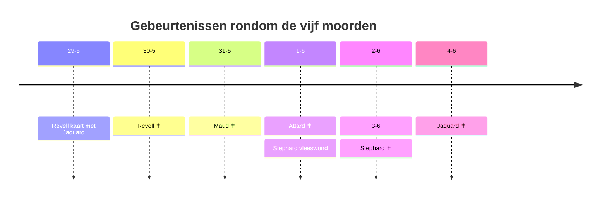

Er zijn vijf moorden gepleegd

1. [[Nathan Revell]] op 30-5
2. [[Cyril Maud]] op 31-5
3. [[Charles Attard]] op 1-6
4. [[Leo Stephard]] op 3-6
5. [[Roland Jaquard]] op 4-6

We hebben deze clues:

1. [[14 NW - Bagatelle Club]]
2. [[38 EC - Coroner Meets]]
3. [[34 WC - Tankerville Club]]
4. [[26 NW - Newbury]]
5. [[31 SW - Novak Adams & Co]]
6. [[37 EC - Telegram office]]
7. [[5 SE - Curtis Twiggs]]
8. [[40 NW - het huis van Jaquard]]
9. [[42 NW - Sherlock Holmes]]
10. [[22 SW - Murray]]
11. [[13 SE - Theater]]

Test

![[case-8-1.png]]

![[case-8-2.png]]

